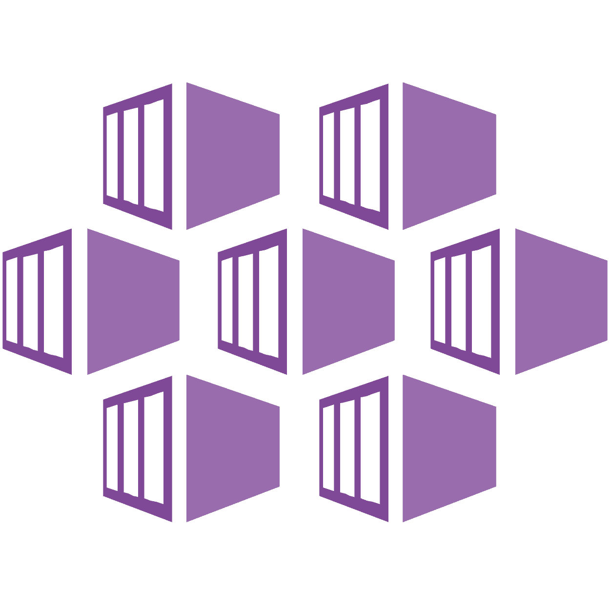

# aks-argocd
Proof of Concept for AKS ArgoCD

> **_NOTE:_** Azure Pipelines (Azure DevOps) being used by template - https://github.com/alexbaptista/azuredevops-iac-template-pipeline


> **_NOTE 2:_** Should be used **AFTER** pipeline execution from repository - https://github.com/alexbaptista/aks-cluster


<br />&nbsp;&nbsp;&nbsp;&nbsp;&nbsp;&nbsp;&nbsp;&nbsp;&nbsp;&nbsp;&nbsp;&nbsp;&nbsp;&nbsp;&nbsp;&nbsp;<br />

### **Folder structure**

```
.
├── azure-pipelines.yaml
└── terraform
    ├── README.md
    ├── azurerm_key_vault_secret.tf
    ├── kubectl_file_documents.tf
    ├── kubectl_manifest.tf
    ├── kubernetes_secret.tf
    ├── main.tf
    ├── manifests
    │   └── v2.4.12
    │       ├── install.yaml
    │       └── namespace.yaml
    ├── outputs.tf
    ├── terraform_remote_state.tf
    └── variables.tf
```

* **[terraform/*](terraform)**: This folder contains Terraform files. The documentation can be accessed [here](terraform/README.md)

* **[terraform/manifests*](argocd)**: This folder contains ArgoCD manifests to be applied into Kubernetes cluster.

## **What does it will create ?**
  
* **ArgoCD**: GitOps tool;

## **Next Steps**

* **Get Access AKS**: https://learn.microsoft.com/en-us/azure/aks/manage-azure-rbac#use-azure-rbac-for-kubernetes-authorization-with-kubectl

* **Get ArgoCD user admin by KeyVault**: https://portal.azure.com/#view/HubsExtension/BrowseResource/resourceType/Microsoft.KeyVault%2Fvaults

* **Run port forward to access ArgoCD**: https://argo-cd.readthedocs.io/en/stable/getting_started/#port-forwarding

## **Notes**

After Terraform done, is necessary to give permission to appropriate users for Keyvault.

Initially, the access is only granted for tenant user used to run Terraform

How to do: https://learn.microsoft.com/en-us/azure/key-vault/general/assign-access-policy?tabs=azure-portal

## **References**

* https://argo-cd.readthedocs.io/en/stable/
* https://azure.microsoft.com/en-us/products/key-vault/
* https://azure.microsoft.com/en-us/products/kubernetes-service/